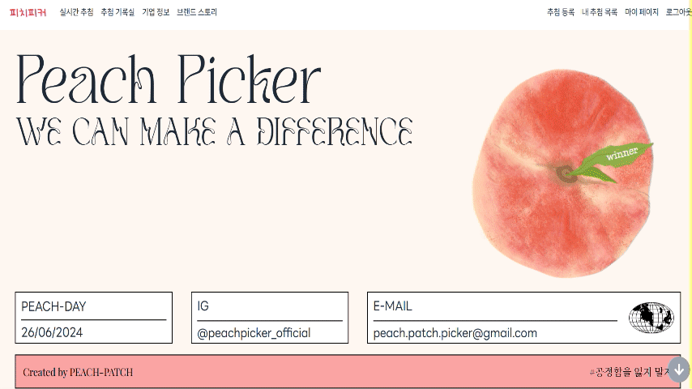
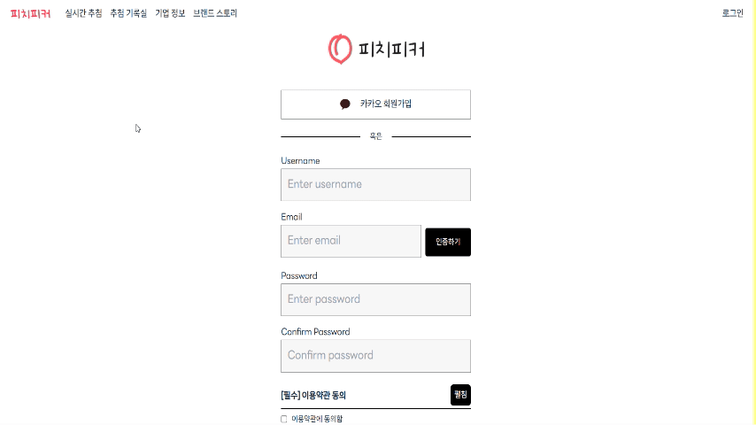
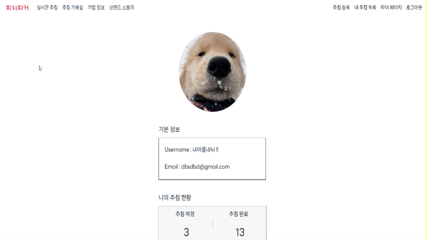
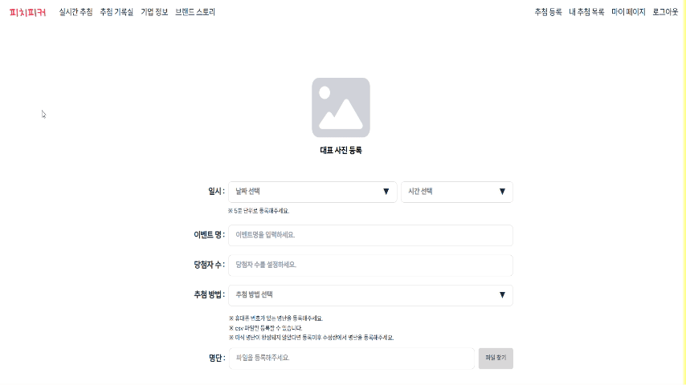
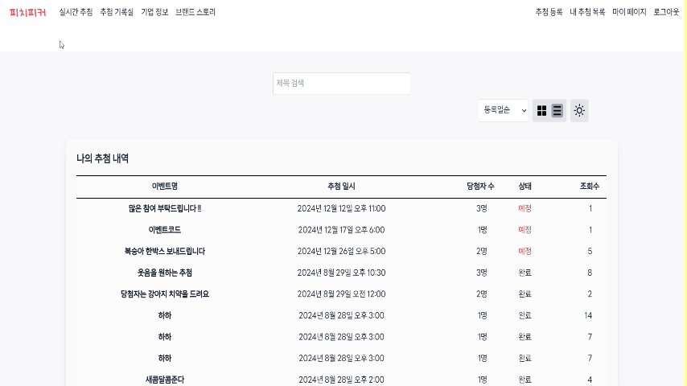
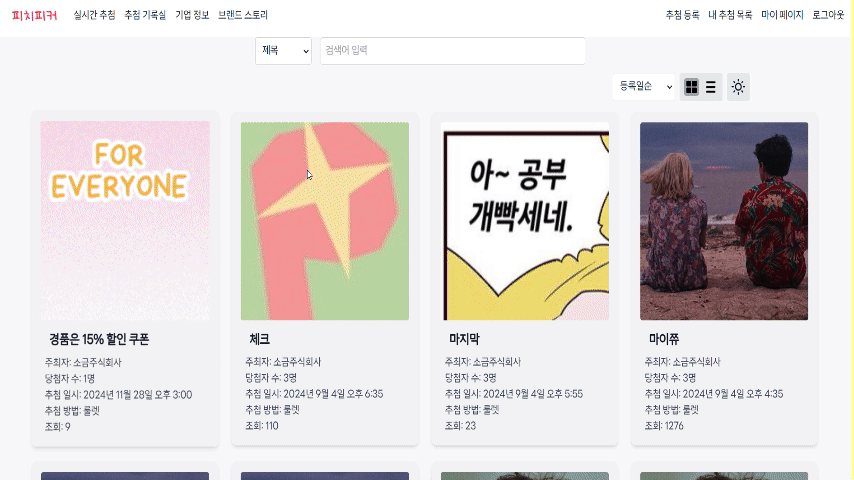
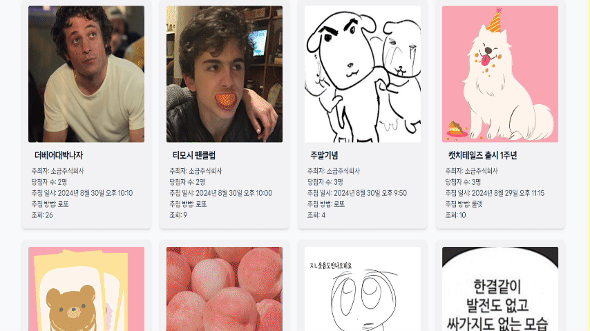
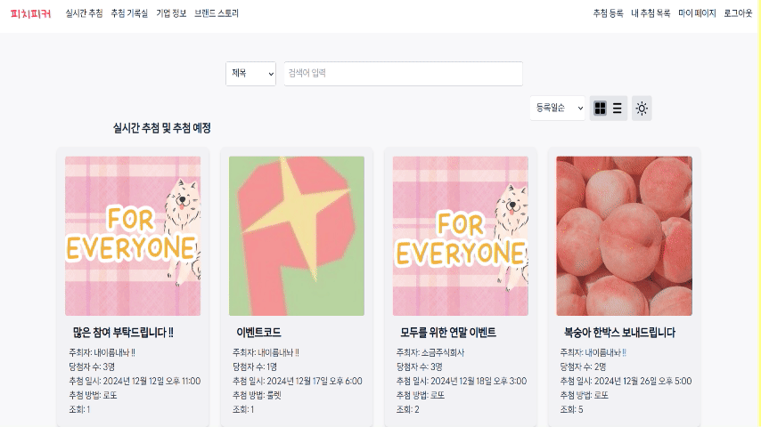
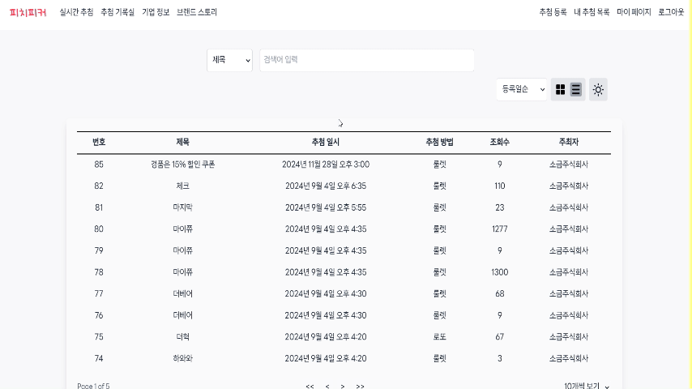
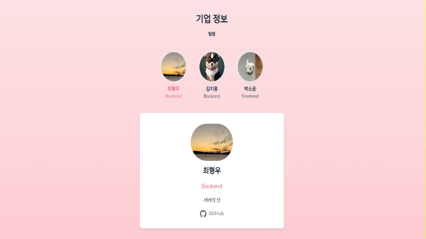

# peach-picker
공정한 추첨을 위한 플랫폼  

v1.1.0 로또 추가(2024.10)

v1.1.1 에러 수정(2024.11)

## ✨ 배포주소
[https://peach-picker.site/](https://peach-picker.site/)

## 🛠 기술스택

### ▪FE


### ▪BE


### ▪협업툴


## 📋 주요 기능
### ▪ 메인화면



### ▪ 회원가입



### ▪ My page



### ▪ 추첨 등록



### ▪ 내 추첨 목록



### ▪ 추첨




### ▪ 추첨 대기 목록



### ▪ 완료 추첨 목록



### ▪ 기업 정보



### ▪ 브랜드 스토리


## 💻 파일 구조
### ▪ FE
```
📦src
 ┣ 📂api
 ┃ ┣ 📜drawingAPI.js
 ┃ ┗ 📜listApi.jsx
 ┣ 📂components
 ┃ ┣ 📂about
 ┃ ┃ ┣ 📜SelectedMemberDetails.js
 ┃ ┃ ┗ 📜TeamMemberList.js
 ┃ ┣ 📂brandstory
 ┃ ┃ ┣ 📜Article.js
 ┃ ┃ ┗ 📜ScrollToTopButton.js
 ┃ ┣ 📂button
 ┃ ┃ ┣ 📜BasicBtn.jsx
 ┃ ┃ ┣ 📜Button.jsx
 ┃ ┃ ┣ 📜DarkModeToggle.jsx
 ┃ ┃ ┗ 📜ShortBtn.jsx
 ┃ ┣ 📂common
 ┃ ┃ ┗ 📜Modal.jsx
 ┃ ┣ 📂drawing
 ┃ ┃ ┣ 📜DrawDetails.jsx
 ┃ ┃ ┣ 📜EmojiRain.jsx
 ┃ ┃ ┣ 📜LottoBox.jsx
 ┃ ┃ ┣ 📜ParticipantsList.jsx
 ┃ ┃ ┣ 📜Wheel.jsx
 ┃ ┃ ┗ 📜WinnersList.jsx
 ┃ ┣ 📂list
 ┃ ┃ ┣ 📜GridView.jsx
 ┃ ┃ ┣ 📜Search.jsx
 ┃ ┃ ┣ 📜SearchAndFilters.js
 ┃ ┃ ┣ 📜SortSelector.jsx
 ┃ ┃ ┣ 📜TablePagination.js
 ┃ ┃ ┣ 📜TableView.js
 ┃ ┃ ┗ 📜ViewSelector.jsx
 ┃ ┣ 📂login
 ┃ ┃ ┣ 📜CheckBox.jsx
 ┃ ┃ ┣ 📜CropProfileImg.jsx
 ┃ ┃ ┣ 📜Input.jsx
 ┃ ┃ ┣ 📜KakaoLogin.jsx
 ┃ ┃ ┗ 📜MemberInfo.jsx
 ┃ ┣ 📂main
 ┃ ┃ ┣ 📜Carousel.jsx
 ┃ ┃ ┣ 📜FirstView.jsx
 ┃ ┃ ┣ 📜LastView.jsx
 ┃ ┃ ┣ 📜SecondView.jsx
 ┃ ┃ ┗ 📜ThirdView.jsx
 ┃ ┣ 📂register
 ┃ ┃ ┣ 📜croppedImg.jsx
 ┃ ┃ ┣ 📜ImgUpload.jsx
 ┃ ┃ ┣ 📜Modal.jsx
 ┃ ┃ ┣ 📜ResisterForm.jsx
 ┃ ┃ ┗ 📜Time.jsx
 ┃ ┣ 📂signup
 ┃ ┃ ┣ 📜EmailVerification.jsx
 ┃ ┃ ┣ 📜KakaoSignup.jsx
 ┃ ┃ ┣ 📜PrivacyPolicy.jsx
 ┃ ┃ ┗ 📜TermsOfService.jsx
 ┃ ┣ 📜Footer.jsx
 ┃ ┗ 📜Menu.jsx
 ┣ 📂contexts
 ┃ ┗ 📜AuthContext.jsx
 ┣ 📂fonts
 ┃ ┣ 📜._LINESeedKR-Th.ttf
 ┃ ┣ 📜base64font.jsx
 ┃ ┣ 📜NotoSansKR-Bold.ttf
 ┃ ┣ 📜NotoSansKR-ExtraBold.ttf
 ┃ ┣ 📜NotoSansKR-Regular.ttf
 ┃ ┗ 📜NotoSansKR-SemiBold.ttf
 ┣ 📂images
 ┃ ┣ 📜001.png
 ┃ ┣ 📜002.png
 ┃ ┣ 📜3dpeach.png
 ┃ ┣ 📜ball.jpg
 ┃ ┣ 📜bell.png
 ┃ ┣ 📜blue_heart.png
 ┃ ┣ 📜brand.png
 ┃ ┣ 📜brand.webp
 ┃ ┣ 📜choi.png
 ┃ ┣ 📜circle.png
 ┃ ┣ 📜diversity.jpg
 ┃ ┣ 📜doggy.jpg
 ┃ ┣ 📜drypeach.png
 ┃ ┣ 📜drypeach11.jfif
 ┃ ┣ 📜earth.png
 ┃ ┣ 📜earth.webp
 ┃ ┣ 📜game.jpg
 ┃ ┣ 📜google.png
 ┃ ┣ 📜green.png
 ┃ ┣ 📜greeny.png
 ┃ ┣ 📜hamburger.png
 ┃ ┣ 📜home.png
 ┃ ┣ 📜justice.jpg
 ┃ ┣ 📜kakao.png
 ┃ ┣ 📜kakaologin.png
 ┃ ┣ 📜kakao_login.png
 ┃ ┣ 📜Kim.png
 ┃ ┣ 📜link.jpg
 ┃ ┣ 📜list.png
 ┃ ┣ 📜lottery.png
 ┃ ┣ 📜lottery1.jfif
 ┃ ┣ 📜lottery3.png
 ┃ ┣ 📜main-picker.png
 ┃ ┣ 📜mainLetter.png
 ┃ ┣ 📜mainLetter.webp
 ┃ ┣ 📜naver.png
 ┃ ┣ 📜paper.jpg
 ┃ ┣ 📜people.jpg
 ┃ ┣ 📜pick_line.png
 ┃ ┣ 📜pink.png
 ┃ ┣ 📜present.png
 ┃ ┣ 📜React_2기_학습일지_학습회고.png
 ┃ ┣ 📜registernow.png
 ┃ ┣ 📜search.png
 ┃ ┣ 📜thirdLogo.png
 ┃ ┣ 📜to.png
 ┃ ┣ 📜treasure.png
 ┃ ┣ 📜upload.png
 ┃ ┣ 📜upload.webp
 ┃ ┣ 📜water.png
 ┃ ┣ 📜water.webp
 ┃ ┗ 📜white.png
 ┣ 📂pages
 ┃ ┣ 📂about
 ┃ ┃ ┗ 📜index.jsx
 ┃ ┣ 📂api
 ┃ ┃ ┣ 📂oauth
 ┃ ┃ ┃ ┗ 📜kakao.jsx
 ┃ ┃ ┣ 📜hello.js
 ┃ ┃ ┣ 📜profile.js
 ┃ ┃ ┗ 📜signup.jsx
 ┃ ┣ 📂brandstory
 ┃ ┃ ┗ 📜index.jsx
 ┃ ┣ 📂completedDrawings
 ┃ ┃ ┗ 📜index.jsx
 ┃ ┣ 📂drawings
 ┃ ┃ ┣ 📜index.jsx
 ┃ ┃ ┗ 📜[drawId].jsx
 ┃ ┣ 📂login
 ┃ ┃ ┣ 📜index.jsx
 ┃ ┃ ┣ 📜signup.jsx
 ┃ ┃ ┗ 📜test.jsx
 ┃ ┣ 📂mypage
 ┃ ┃ ┣ 📂mylist
 ┃ ┃ ┃ ┗ 📜index.jsx
 ┃ ┃ ┣ 📜edit.jsx
 ┃ ┃ ┗ 📜index.js
 ┃ ┣ 📂oauth
 ┃ ┃ ┣ 📂code
 ┃ ┃ ┃ ┗ 📜kakao.jsx
 ┃ ┃ ┗ 📜index.jsx
 ┃ ┣ 📂register
 ┃ ┃ ┣ 📜edit.jsx
 ┃ ┃ ┗ 📜index.jsx
 ┃ ┣ 📜index.js
 ┃ ┣ 📜_app.js
 ┃ ┗ 📜_document.js
 ┣ 📂store
 ┃ ┣ 📜authStore.jsx
 ┃ ┣ 📜darkModeStore.jsx
 ┃ ┣ 📜drawingStore.jsx
 ┃ ┗ 📜winnerStore.js
 ┣ 📂styles
 ┃ ┗ 📜globals.css
 ┗ 📜setupProxy.js
```
### ▪ BE
```

📦src
 ┣ 📂main
 ┃ ┣ 📂java
 ┃ ┃ ┗ 📂com
 ┃ ┃ ┃ ┗ 📂peach
 ┃ ┃ ┃ ┃ ┗ 📂backend
 ┃ ┃ ┃ ┃ ┃ ┣ 📂domain
 ┃ ┃ ┃ ┃ ┃ ┃ ┣ 📂drawing
 ┃ ┃ ┃ ┃ ┃ ┃ ┃ ┣ 📂controller
 ┃ ┃ ┃ ┃ ┃ ┃ ┃ ┃ ┗ 📜DrawingController.java
 ┃ ┃ ┃ ┃ ┃ ┃ ┃ ┣ 📂dto
 ┃ ┃ ┃ ┃ ┃ ┃ ┃ ┃ ┣ 📂req
 ┃ ┃ ┃ ┃ ┃ ┃ ┃ ┃ ┃ ┣ 📜DrawingReq.java
 ┃ ┃ ┃ ┃ ┃ ┃ ┃ ┃ ┃ ┣ 📜DrawingSeedReq.java
 ┃ ┃ ┃ ┃ ┃ ┃ ┃ ┃ ┃ ┣ 📜GetDrawingListReq.java
 ┃ ┃ ┃ ┃ ┃ ┃ ┃ ┃ ┃ ┗ 📜StartDrawingReq.java
 ┃ ┃ ┃ ┃ ┃ ┃ ┃ ┃ ┗ 📂resp
 ┃ ┃ ┃ ┃ ┃ ┃ ┃ ┃ ┃ ┣ 📜GetDrawingDetailsResp.java
 ┃ ┃ ┃ ┃ ┃ ┃ ┃ ┃ ┃ ┗ 📜GetDrawingListResp.java
 ┃ ┃ ┃ ┃ ┃ ┃ ┃ ┣ 📂entity
 ┃ ┃ ┃ ┃ ┃ ┃ ┃ ┃ ┣ 📂repository
 ┃ ┃ ┃ ┃ ┃ ┃ ┃ ┃ ┃ ┣ 📜DrawingRepository.java
 ┃ ┃ ┃ ┃ ┃ ┃ ┃ ┃ ┃ ┣ 📜DrawingSeedRepository.java
 ┃ ┃ ┃ ┃ ┃ ┃ ┃ ┃ ┃ ┗ 📜ParticipantRepository.java
 ┃ ┃ ┃ ┃ ┃ ┃ ┃ ┃ ┣ 📜Drawing.java
 ┃ ┃ ┃ ┃ ┃ ┃ ┃ ┃ ┣ 📜DrawingSeed.java
 ┃ ┃ ┃ ┃ ┃ ┃ ┃ ┃ ┗ 📜Participant.java
 ┃ ┃ ┃ ┃ ┃ ┃ ┃ ┣ 📂enums
 ┃ ┃ ┃ ┃ ┃ ┃ ┃ ┃ ┣ 📜DrawingStatus.java
 ┃ ┃ ┃ ┃ ┃ ┃ ┃ ┃ ┗ 📜DrawingType.java
 ┃ ┃ ┃ ┃ ┃ ┃ ┃ ┣ 📂exception
 ┃ ┃ ┃ ┃ ┃ ┃ ┃ ┃ ┣ 📂error
 ┃ ┃ ┃ ┃ ┃ ┃ ┃ ┃ ┃ ┗ 📜DrawingErrorProperty.java
 ┃ ┃ ┃ ┃ ┃ ┃ ┃ ┃ ┣ 📜DrawingAtErrorException.java
 ┃ ┃ ┃ ┃ ┃ ┃ ┃ ┃ ┣ 📜DrawingCompletedErrorException.java
 ┃ ┃ ┃ ┃ ┃ ┃ ┃ ┃ ┗ 📜DrawingNotFoundException.java
 ┃ ┃ ┃ ┃ ┃ ┃ ┃ ┣ 📂facade
 ┃ ┃ ┃ ┃ ┃ ┃ ┃ ┃ ┗ 📜DrawingFacade.java
 ┃ ┃ ┃ ┃ ┃ ┃ ┃ ┗ 📂service
 ┃ ┃ ┃ ┃ ┃ ┃ ┃ ┃ ┣ 📜CreateDrawingSeedService.java
 ┃ ┃ ┃ ┃ ┃ ┃ ┃ ┃ ┣ 📜CreateDrawingService.java
 ┃ ┃ ┃ ┃ ┃ ┃ ┃ ┃ ┣ 📜DeleteDrawingService.java
 ┃ ┃ ┃ ┃ ┃ ┃ ┃ ┃ ┣ 📜DoDrawingService.java
 ┃ ┃ ┃ ┃ ┃ ┃ ┃ ┃ ┣ 📜GetDrawingService.java
 ┃ ┃ ┃ ┃ ┃ ┃ ┃ ┃ ┗ 📜StartDrawingService.java
 ┃ ┃ ┃ ┃ ┃ ┃ ┗ 📂user
 ┃ ┃ ┃ ┃ ┃ ┃ ┃ ┣ 📂controller
 ┃ ┃ ┃ ┃ ┃ ┃ ┃ ┃ ┗ 📜UserController.java
 ┃ ┃ ┃ ┃ ┃ ┃ ┃ ┣ 📂dto
 ┃ ┃ ┃ ┃ ┃ ┃ ┃ ┃ ┣ 📂kakao
 ┃ ┃ ┃ ┃ ┃ ┃ ┃ ┃ ┃ ┣ 📜KakaoCodeReq.java
 ┃ ┃ ┃ ┃ ┃ ┃ ┃ ┃ ┃ ┣ 📜KakaoProfile.java
 ┃ ┃ ┃ ┃ ┃ ┃ ┃ ┃ ┃ ┗ 📜KakaoToken.java
 ┃ ┃ ┃ ┃ ┃ ┃ ┃ ┃ ┣ 📂mail
 ┃ ┃ ┃ ┃ ┃ ┃ ┃ ┃ ┃ ┗ 📜EmailVerifyingDto.java
 ┃ ┃ ┃ ┃ ┃ ┃ ┃ ┃ ┣ 📂req
 ┃ ┃ ┃ ┃ ┃ ┃ ┃ ┃ ┃ ┣ 📜ProfileUpdateReq.java
 ┃ ┃ ┃ ┃ ┃ ┃ ┃ ┃ ┃ ┣ 📜SignInReq.java
 ┃ ┃ ┃ ┃ ┃ ┃ ┃ ┃ ┃ ┗ 📜SignUpReq.java
 ┃ ┃ ┃ ┃ ┃ ┃ ┃ ┃ ┗ 📂resp
 ┃ ┃ ┃ ┃ ┃ ┃ ┃ ┃ ┃ ┣ 📜ProfileResp.java
 ┃ ┃ ┃ ┃ ┃ ┃ ┃ ┃ ┃ ┗ 📜SignInResp.java
 ┃ ┃ ┃ ┃ ┃ ┃ ┃ ┣ 📂entity
 ┃ ┃ ┃ ┃ ┃ ┃ ┃ ┃ ┣ 📂repository
 ┃ ┃ ┃ ┃ ┃ ┃ ┃ ┃ ┃ ┗ 📜UserRepository.java
 ┃ ┃ ┃ ┃ ┃ ┃ ┃ ┃ ┗ 📜User.java
 ┃ ┃ ┃ ┃ ┃ ┃ ┃ ┣ 📂enums
 ┃ ┃ ┃ ┃ ┃ ┃ ┃ ┃ ┗ 📜Role.java
 ┃ ┃ ┃ ┃ ┃ ┃ ┃ ┣ 📂facade
 ┃ ┃ ┃ ┃ ┃ ┃ ┃ ┃ ┗ 📜UserFacade.java
 ┃ ┃ ┃ ┃ ┃ ┃ ┃ ┣ 📂service
 ┃ ┃ ┃ ┃ ┃ ┃ ┃ ┃ ┣ 📜CreateUserService.java
 ┃ ┃ ┃ ┃ ┃ ┃ ┃ ┃ ┣ 📜DeleteUserService.java
 ┃ ┃ ┃ ┃ ┃ ┃ ┃ ┃ ┣ 📜EmailVerificationService.java
 ┃ ┃ ┃ ┃ ┃ ┃ ┃ ┃ ┣ 📜GetUserService.java
 ┃ ┃ ┃ ┃ ┃ ┃ ┃ ┃ ┣ 📜KakaoLoginService.java
 ┃ ┃ ┃ ┃ ┃ ┃ ┃ ┃ ┗ 📜UpdateUserService.java
 ┃ ┃ ┃ ┃ ┃ ┃ ┃ ┗ 📂util
 ┃ ┃ ┃ ┃ ┃ ┃ ┃ ┃ ┗ 📜EmailUtil.java
 ┃ ┃ ┃ ┃ ┃ ┣ 📂global
 ┃ ┃ ┃ ┃ ┃ ┃ ┣ 📂config
 ┃ ┃ ┃ ┃ ┃ ┃ ┃ ┣ 📜CacheConfig.java
 ┃ ┃ ┃ ┃ ┃ ┃ ┃ ┣ 📜RedisConfig.java
 ┃ ┃ ┃ ┃ ┃ ┃ ┃ ┣ 📜SpringConfig.java
 ┃ ┃ ┃ ┃ ┃ ┃ ┃ ┗ 📜WebConfig.java
 ┃ ┃ ┃ ┃ ┃ ┃ ┣ 📂entity
 ┃ ┃ ┃ ┃ ┃ ┃ ┃ ┗ 📜BaseTimeEntity.java
 ┃ ┃ ┃ ┃ ┃ ┃ ┣ 📂error
 ┃ ┃ ┃ ┃ ┃ ┃ ┃ ┣ 📂exception
 ┃ ┃ ┃ ┃ ┃ ┃ ┃ ┃ ┣ 📜CommonException.java
 ┃ ┃ ┃ ┃ ┃ ┃ ┃ ┃ ┣ 📜ErrorCode.java
 ┃ ┃ ┃ ┃ ┃ ┃ ┃ ┃ ┣ 📜ErrorProperty.java
 ┃ ┃ ┃ ┃ ┃ ┃ ┃ ┃ ┗ 📜PeachPickerException.java
 ┃ ┃ ┃ ┃ ┃ ┃ ┃ ┣ 📜ErrorResponse.java
 ┃ ┃ ┃ ┃ ┃ ┃ ┃ ┗ 📜PeachPickerExceptionHandler.java
 ┃ ┃ ┃ ┃ ┃ ┃ ┣ 📂security
 ┃ ┃ ┃ ┃ ┃ ┃ ┃ ┣ 📂config
 ┃ ┃ ┃ ┃ ┃ ┃ ┃ ┃ ┗ 📜SpringSecurityConfig.java
 ┃ ┃ ┃ ┃ ┃ ┃ ┃ ┣ 📂dto
 ┃ ┃ ┃ ┃ ┃ ┃ ┃ ┃ ┣ 📜CurrentUser.java
 ┃ ┃ ┃ ┃ ┃ ┃ ┃ ┃ ┗ 📜CustomUserDetails.java
 ┃ ┃ ┃ ┃ ┃ ┃ ┃ ┣ 📂exception
 ┃ ┃ ┃ ┃ ┃ ┃ ┃ ┃ ┣ 📂error
 ┃ ┃ ┃ ┃ ┃ ┃ ┃ ┃ ┃ ┗ 📜JwtErrorProperty.java
 ┃ ┃ ┃ ┃ ┃ ┃ ┃ ┃ ┣ 📜ExpiredTokenException.java
 ┃ ┃ ┃ ┃ ┃ ┃ ┃ ┃ ┗ 📜InvalidTokenException.java
 ┃ ┃ ┃ ┃ ┃ ┃ ┃ ┣ 📂filter
 ┃ ┃ ┃ ┃ ┃ ┃ ┃ ┃ ┗ 📜JwtAuthenticationFilter.java
 ┃ ┃ ┃ ┃ ┃ ┃ ┃ ┣ 📂service
 ┃ ┃ ┃ ┃ ┃ ┃ ┃ ┃ ┣ 📜CustomUserDetailsService.java
 ┃ ┃ ┃ ┃ ┃ ┃ ┃ ┃ ┗ 📜JwtValidateService.java
 ┃ ┃ ┃ ┃ ┃ ┃ ┃ ┗ 📂util
 ┃ ┃ ┃ ┃ ┃ ┃ ┃ ┃ ┣ 📜CustomUserUtil.java
 ┃ ┃ ┃ ┃ ┃ ┃ ┃ ┃ ┣ 📜JwtProperties.java
 ┃ ┃ ┃ ┃ ┃ ┃ ┃ ┃ ┗ 📜JwtTokenProvider.java
 ┃ ┃ ┃ ┃ ┃ ┃ ┣ 📂util
 ┃ ┃ ┃ ┃ ┃ ┃ ┃ ┣ 📂csv
 ┃ ┃ ┃ ┃ ┃ ┃ ┃ ┃ ┣ 📂dto
 ┃ ┃ ┃ ┃ ┃ ┃ ┃ ┃ ┃ ┗ 📜ParticipantsCsvDto.java
 ┃ ┃ ┃ ┃ ┃ ┃ ┃ ┃ ┗ 📜CsvUtil.java
 ┃ ┃ ┃ ┃ ┃ ┃ ┃ ┣ 📂exception
 ┃ ┃ ┃ ┃ ┃ ┃ ┃ ┃ ┣ 📂error
 ┃ ┃ ┃ ┃ ┃ ┃ ┃ ┃ ┃ ┗ 📜CsvErrorProperty.java
 ┃ ┃ ┃ ┃ ┃ ┃ ┃ ┃ ┗ 📜CsvReadErrorException.java
 ┃ ┃ ┃ ┃ ┃ ┃ ┃ ┗ 📂minio
 ┃ ┃ ┃ ┃ ┃ ┃ ┃ ┃ ┣ 📂config
 ┃ ┃ ┃ ┃ ┃ ┃ ┃ ┃ ┃ ┗ 📜MinioConfig.java
 ┃ ┃ ┃ ┃ ┃ ┃ ┃ ┃ ┣ 📂dto
 ┃ ┃ ┃ ┃ ┃ ┃ ┃ ┃ ┃ ┗ 📜MinioProperties.java
 ┃ ┃ ┃ ┃ ┃ ┃ ┃ ┃ ┣ 📂exception
 ┃ ┃ ┃ ┃ ┃ ┃ ┃ ┃ ┃ ┣ 📂error
 ┃ ┃ ┃ ┃ ┃ ┃ ┃ ┃ ┃ ┃ ┗ 📜MinioErrorProperty.java
 ┃ ┃ ┃ ┃ ┃ ┃ ┃ ┃ ┃ ┣ 📜MinioCanNotPutException.java
 ┃ ┃ ┃ ┃ ┃ ┃ ┃ ┃ ┃ ┗ 📜MinioObjectNotFoundException.java
 ┃ ┃ ┃ ┃ ┃ ┃ ┃ ┃ ┗ 📜MinioUtil.java
 ┃ ┃ ┃ ┃ ┃ ┃ ┗ 📂validator
 ┃ ┃ ┃ ┃ ┃ ┃ ┃ ┣ 📂annotation
 ┃ ┃ ┃ ┃ ┃ ┃ ┃ ┃ ┣ 📜CsvFileOnly.java
 ┃ ┃ ┃ ┃ ┃ ┃ ┃ ┃ ┣ 📜FiveMinuteInterval.java
 ┃ ┃ ┃ ┃ ┃ ┃ ┃ ┃ ┗ 📜RequestNotNull.java
 ┃ ┃ ┃ ┃ ┃ ┃ ┃ ┗ 📂impl
 ┃ ┃ ┃ ┃ ┃ ┃ ┃ ┃ ┣ 📜CsvFileOnlyValidator.java
 ┃ ┃ ┃ ┃ ┃ ┃ ┃ ┃ ┣ 📜FiveMinuteIntervalValidator.java
 ┃ ┃ ┃ ┃ ┃ ┃ ┃ ┃ ┗ 📜RequestNotNullValidator.java
 ┃ ┃ ┃ ┃ ┃ ┗ 📜BackendApplication.java
 ┃ ┗ 📂resources
 ┃ ┃ ┣ 📂error
 ┃ ┃ ┃ ┗ 📜exception.yml
 ┃ ┃ ┗ 📂templates
 ┃ ┃ ┃ ┗ 📜code.html
 ┗ 📂test
 ┃ ┗ 📂java
 ┃ ┃ ┗ 📂com
 ┃ ┃ ┃ ┗ 📂peach
 ┃ ┃ ┃ ┃ ┗ 📂backend
 ┃ ┃ ┃ ┃ ┃ ┣ 📂security
 ┃ ┃ ┃ ┃ ┃ ┃ ┗ 📜SecurityTest.java
 ┃ ┃ ┃ ┃ ┃ ┣ 📂user
 ┃ ┃ ┃ ┃ ┃ ┃ ┗ 📜UserTest.java
 ┃ ┃ ┃ ┃ ┃ ┗ 📜BackendApplicationTests.java
```


## 👨‍💻 팀원
| 이름     | 역할                                    |
| -------- | --------------------------------------- |
| 최형우   | BE   |
| 김지홍 | BE          |
| 박소윤   | FE               |

